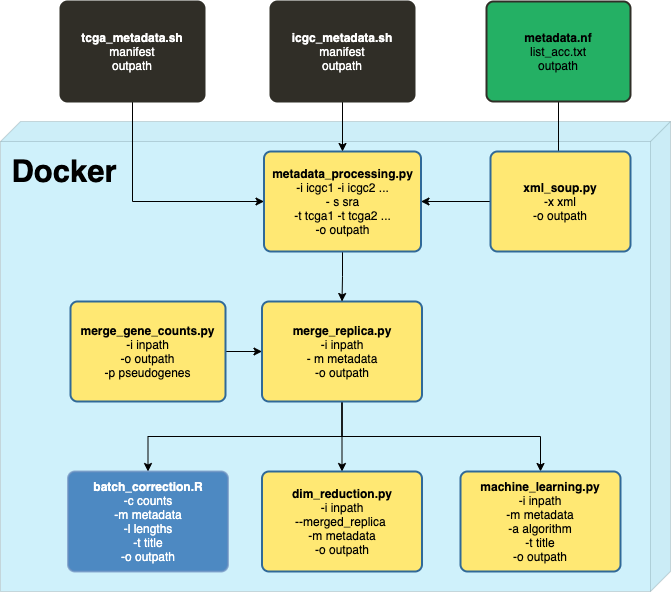

Getting Started
===============

This chapter gives an introduction into the preprocessing steps of RNA-Seq expression data from different public repositories.
It documents how to download data and metadata, setup a conda environment or Docker container to use the scripts written in bash, nextflow, python and R.

Features
********

* Download RNA-Seq expression data from repositories
* Convert BAM to FASTQ and use nf-core/rnaseq
* Download metadata from TCGA, ICGC, GTEx, SRA
* Extract metadata into a table in csv format
* Merge TPM values from nf-core/rnaseq/stringTieFPKM
* Merge raw featureCounts from nf-core/rnaseq/featureCounts
* Clustering analyses performing PCA, TSNE, UMAP
* Batch correction with ComBat, CombatSeq, removeBatchEffect()
* Supvervised Classification Machine Learning: LinearSVM, SVM, RandomForest, MultiLayerPerceptron 

Main Workflow Overview
***********************

Prerequisites
*************

..
   Checkout `qbic-docs <https://pipeline-docs.readthedocs.io/en/latest/index.html>`_

.. seealso::  

   Assure `nextflow <https://www.nextflow.io/docs/latest/getstarted.html>`_, `docker <https://docs.docker.com/engine/install/centos/>`_, `singularity <https://sylabs.io/guides/3.0/user-guide/installation.html#before-you-begin>`_  are installed

Setting-up conda environment
****************************

* Requires ``conda``
* Requires ``python version 3.8.8``
* Requires ``python_scripts/environment.yml``

.. code-block:: bash
   
   conda env create -f environment.yml

Activate the environment to run the scripts 

.. code-block:: bash
   
   conda activate python_scripts

Alternative set up with docker container
****************************************

* Requires ``python_scripts/Dockerfile``
* Requires ``python_scripts/environment.yml``

.. code-block:: bash

   # folder structure

   ├── app/
   │   ├── tools.py     
   ├── data/
   │     ├── ...  
   ├── Dockerfile
   ├── environment.yml
   └── results/

   # from within folder containing scripts, Dockerfile and environment.yml
   docker build -t <name> .

   docker run -it --rm -w <work_dir> -v <host_dir>:<container_dir> <container_name>